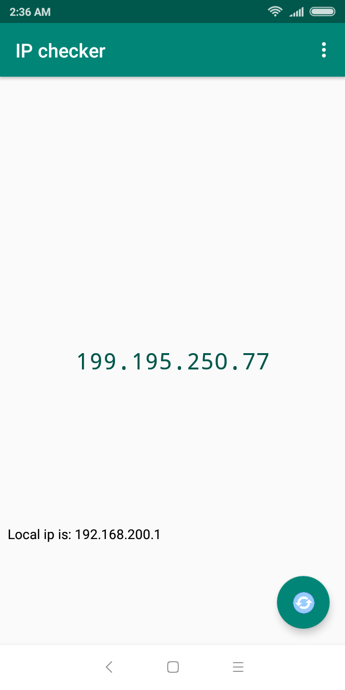

# [IP checker](https://play.google.com/store/apps/details?id=bem.ware.yoipis&utm_source=gh&utm_campaign=readme&pcampaignid=MKT-Other-global-all-co-prtnr-py-PartBadge-Mar2515-1)

Screenshots
------------------------

